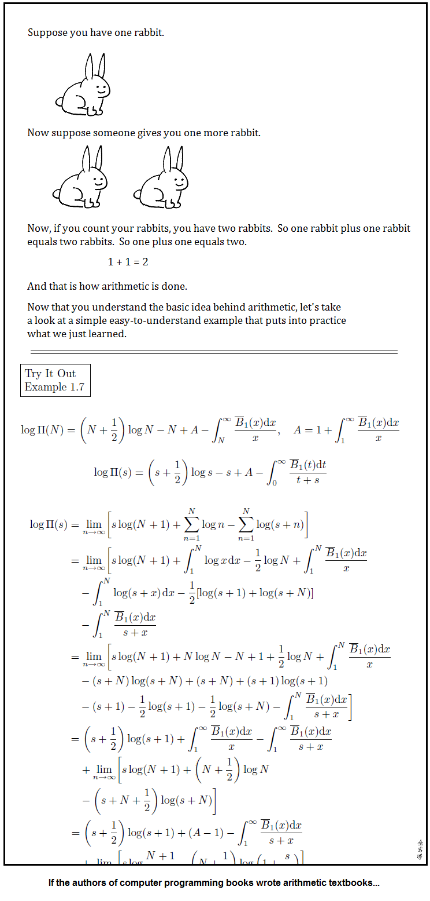
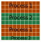

# Multi-core processing in Python with NumPy

https://tbnorth.github.io/multiproc/


## Requirements

- Requires NumPy
- Works in Python 2.7, but these demos only tested in
  Python 3.6


## CPU Loading


## threading / multiprocessing / asyncio

- `threading` allows code to keep running while waiting for
  file / network / DB input / output.
- `asyncio` ~= better `threading`<br/>(new in Python 3.4).
- `multiprocessing` runs separate processes on separate CPU
  cores.


## Python GIL

You may hear / read:

“Python has a Global Interpreter Lock (GIL) which
prevents it from executing code simultaneously.”

This **does not** apply to the `multiprocessing`
module, which uses inter-process communication to
coordinate separate processes.


## Cheap, disposable, or expensive, persistent

- Using `threading`, you might cheaply invoke a *function* which
  saves data to disk while the main program runs uninterrupted,
  the thread is used once.
- Using `multiprocessing` start-up cost of the new process will
  exceed savings for trivial operations, but you
  can re-use the process, coordinating with special
  message passing methods.


## Cheap, disposable, or expensive, persistent

- For really long CPU intensive processes `multiprocessing` start-up
  cost may be low enough to allow single use processes.


## Summary

- IO bound operations, use `threading` (or `asyncio`).
- Small CPU bound operations (< 1-5 sec.), *re-use* processes
  with `multiprocessing` and communication,
- Large CPU bound operations, like processing a folder of
  images, process reuse doesn't matter.


## multiprocessing / NumPy

- `multiprocessing` uses separate instances of “python.exe”
  which can communicate with **expensive** message passing
  to move information between processes.
- NumPy supports shared memory for its arrays, so separate
  programs can operate on the same data.


## Multi-process / main

```python
from multiprocessing import Process
import os

def hello(n):
    print("Sub-process %s: %s" % (n, os.getpid()))

if __name__ == '__main__':
    for i in range(4):
        proc = Process(target=hello, args=(i,))
        proc.start()
    print("Main process: %s" % os.getpid())
```


## Multi-process / main

```
Sub-process 0: 17409
Sub-process 1: 17410
Main process: 17408
Sub-process 2: 17411
Sub-process 3: 17412
```


https://abstrusegoose.com/474

<!-- .element: data-state='scrollable' -->

https://abstrusegoose.com/474


## Task queue

```python
import time
from multiprocessing import Process, JoinableQueue
from queue import Empty

def proc_queue(queue):
    while True:
        try:
            task = queue.get(timeout=5)
        except Empty:
            break
        do_task(task)
        queue.task_done()
    print("(sub-process ends)")

def print_number(n):
    print(n)
    time.sleep(3)

def do_task(task):
    if task['task'] == 'print_number':
        print_number(task['data']['n'])
    else:
        raise Exception("Unknown task: " + task['task'])

if __name__ == '__main__':

    queue = JoinableQueue()

    for i in range(4):
        proc = Process(target=proc_queue, args=(queue,))
        proc.start()

    for i in range(10):
        queue.put({'task': 'print_number', 'data': {'n': i}})

    queue.join()
    print("(main process ends)")
```


## Task queue

```
10:35 0
10:35 1
10:35 2
10:35 3
10:38 4
10:38 5
10:38 6
10:38 7
10:41 8
10:41 9
10:44 (main process ends)
10:46 (sub-process ends)
10:46 (sub-process ends)
10:49 (sub-process ends)
10:49 (sub-process ends)
```


## Sharing an array

```python
shared_grid = Array('d', rows * cols, lock=False)
```

allocates an array of type 'd' (double) with enough
entries for a rows * cols array.  Then:

```python
grid = np.frombuffer(shared_grid)
grid.shape = (rows, cols)
```

makes a normal NumPy array using that memory.

Locking may or may not be important,<br/>not covered here.


## Sharing work




## NumPy shared array

```python
import numpy as np
import time
from multiprocessing import Array, JoinableQueue, Process

def setup(queue, shared_grid, rows, cols):
    global grid
    grid = np.frombuffer(shared_grid)
    grid.shape = (rows, cols)
    proc_queue(queue)

def proc_queue(queue):
    while True:
        task = queue.get()
        if task['task'] == 'exit':
            break
        do_task(task)
        queue.task_done()
    print("(sub-process ends)")

def inc_rows(start, end):
    print("Doing %s-%s" % (start, end))
    for row in range(start, end):
        for col in range(grid.shape[1]):
            for i in range(1000000):
                grid[row][col] += 0.000001 * col + row

def do_task(task):
    if task['task'] == 'inc_rows':
        inc_rows(task['data']['start'], task['data']['end'])
    else:
        raise Exception("Unknown task: " + task['task'])

if __name__ == '__main__':

    queue = JoinableQueue()

    rows, cols = 10, 10

    shared_grid = Array('d', rows * cols, lock=False)
    grid = np.frombuffer(shared_grid)
    grid.shape = (rows, cols)

    for i in range(2):
        proc = Process(target=setup, args=(queue, shared_grid, rows, cols))
        proc.start()

    start = time.time()
    for i in range(4):
        queue.put(
            {'task': 'inc_rows', 'data': {'start': 3 * i, 'end': min(rows, 3 * i + 3)}}
        )
    queue.join()
    print("done in %s" % (time.time() - start))
    answer0 = np.array(grid)
    grid[:] = 0
    start = time.time()
    queue.put({'task': 'inc_rows', 'data': {'start': 0, 'end': 10}})
    queue.join()
    print("done in %s" % (time.time() - start))
    answer1 = np.array(grid)

    assert (answer0 == answer1).all()

    for i in range(2):
        queue.put({'task': 'exit'})
```


## NumPy shared array

```
14:18 Doing 0-3
14:18 Doing 3-6
14:28 Doing 6-9
14:28 Doing 9-10
14:38 done in 20.168675422668457
14:38 Doing 0-10
15:11 done in 33.22339630126953
15:11 (sub-process ends)
15:11 (sub-process ends)
```


## Source

- https://github.com/tbnorth/multiproc
- [mp_demo0.py](./mp_demo0.py)
- [mp_demo1.py](./mp_demo1.py)
- [mp_demo2.py](./mp_demo2.py)


